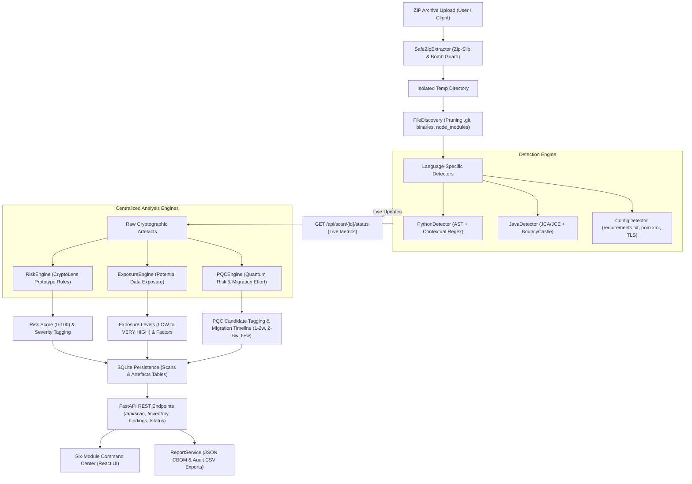

# Cryptographic Discovery System Architecture & Technical Specification

## 1. Architectural Philosophy & Six-Module Workflow
Cryptographic Discovery is engineered around three core design principles:
1. **Zero-Execution Static Security**: Untrusted user-supplied code is never executed, imported, or run in an interpreter. Analysis is strictly AST- and pattern-driven.
2. **Deterministic Evidence-Based Discovery**: No probabilistic guesses or hallucinations. Every finding is anchored to an exact file, line number, and verifiable source snippet.
3. **Dynamic Real-Time Pipeline**: Scans are tracked asynchronously with live backend updates through `/api/scan/{scan_id}/status`, providing transparent visibility into every file, algorithm, and stage.

The platform is organized into six functional modules:
- **01 Discovery**: *Assets Ingestion Console* (Archive ingestion, safe unpack, live progress console)
- **02 Overview**: *Executive Readiness Center* (Readiness dashboard, risk score, exposure, migration status)
- **03 CBOM**: *Cryptographic Inventory Studio* (CBOM-ready inventory table, multi-parameter filtering, exports)
- **04 Risk / Mosca**: *Quantum Exposure Engine* (Classical breaks, quantum threats, interactive Mosca's Theorem urgency model)
- **05 Dependencies**: *Blast Radius Visualizer* (Asset-to-file-to-library relationship graph)
- **06 Migration**: *Hybrid Remediation Workbench* (Actionable remediation guidance, prototype hybrid wrappers)

---

## 2. End-to-End Data Flow Pipeline

---

## 3. Component Deep Dive

### 3.1 Backend Architecture (`backend/app/`)

#### A. Scanner Layer (`app/scanner/`)
- `SafeZipExtractor`:
  - Enforces `MAX_UPLOAD_SIZE_BYTES` (100 MB).
  - Enforces `MAX_EXTRACTED_SIZE_BYTES` (250 MB).
  - Enforces `MAX_FILES_COUNT` (2,000 files).
  - Enforces `MAX_COMPRESSION_RATIO` (100:1) to thwart nested zip bombs.
  - Implements canonical common-path verification (`os.path.commonpath([dest, target]) == dest`) to prevent Zip-Slip directory traversal exploits (`../../`).
  - Rejects UNIX symlinks.
- `FileDiscovery`:
  - Recursively crawls the unpacked repository.
  - Ignores irrelevant and large build folders: `.git`, `node_modules`, `venv`, `__pycache__`, `dist`, `build`.
  - Performs null-byte binary file detection (`b"\x00"` in header) to avoid scanning compiled `.class`, `.pyc`, or `.exe` binaries.

#### B. Detectors Layer (`app/detectors/`)
- `PatternRegistry`: Canonical lookup table providing standardized metadata for over 20 algorithm families, including default key sizes, cipher modes, and risk levels.
- `PythonDetector`:
  - Primary: Python `ast.NodeVisitor` analyzing `Call`, `Attribute`, `Import`, and `ImportFrom` nodes. Detects `hashlib.md5()`, `hashlib.new()`, `DES.new(key, MODE_ECB)`, `AES.new()`, `rsa.generate_private_key()`, `ec.generate_private_key()`, `Ed25519PrivateKey.generate()`, and `hmac.new()`.
  - Secondary: Context-aware regex engine for fallback and dynamic library patterns.
- `JavaDetector`:
  - Static pattern engine parsing Java Cryptography Architecture (JCA / JCE) contracts: `Cipher.getInstance("DESede/CBC/PKCS5Padding")`, `MessageDigest.getInstance("MD5")`, `KeyPairGenerator.getInstance("RSA")` with `.initialize(1024)`, and `Mac.getInstance("HmacSHA256")`.
- `ConfigDetector`:
  - Parses dependency manifests (`requirements.txt`, `package.json`, `pom.xml`) for obsolete packages like `pycrypto` (CVE-2013-7459) and modern providers like `bouncycastle`.
  - Parses configuration files for deprecated TLS protocols (`TLSv1.0`, `TLSv1.1`, `SSLv3`).

#### C. Centralized Rules & Risk Engine (`app/rules/`)
- `RiskEngine`:
  - Configurable rule mapping labeled **"CryptoLens Prototype Rules"**.
  - Maps algorithms, cipher modes, and key lengths into standard severities (`CRITICAL`, `HIGH`, `MEDIUM`, `LOW`, `INFORMATIONAL`, `WARNING`).
  - Penalizes unauthenticated modes (e.g. `AES-ECB` receives `HIGH` severity even though AES is a strong cipher).
  - Computes the **CryptoLens Prototype Risk Score**:
    $$\text{Score} = \max\left(0, 100 - \sum \text{Deductions}\right)$$
    where Critical = 25, High = 15, Medium = 8, Warning = 5, Low = 1.
- `ExposureEngine`:
  - Evaluates **Potential Data Exposure** on a 5-tier scale: `LOW`, `MEDIUM`, `HIGH`, `VERY HIGH`, `UNKNOWN`.
  - Examines factors such as broken mathematical premises (DES 56-bit keyspace brute-forceable in hours), Sweet32 block collisions (3DES), pattern preservation (AES ECB), and weak public-key factorization (RSA-1024).
  - Includes mandatory non-alarmist disclaimer.
- `PQCEngine`:
  - Assesses **Quantum Relevance** (`HIGH`, `MEDIUM`, `LOW`, `UNKNOWN`).
  - Identifies asymmetric algorithms (RSA, ECC, ECDSA, Ed25519, Diffie-Hellman) as **PQC Migration Candidates** due to Shor's algorithm.
  - Classifies AES-256 and SHA-256/384/512 as **Not Required** for immediate PQC migration because Grover's algorithm leaves adequate quantum security margins.
  - Generates **Estimated Post-Quantum Migration Effort**:
    - `LOW` (1–2 weeks): Isolated routines or key-size parameter upgrades.
    - `MEDIUM` (2–6 weeks): Single or few asymmetric endpoints requiring key lifecycle, API contract, and compatibility testing.
    - `HIGH` (6+ weeks): Multiple asymmetric touchpoints across files requiring architectural PKI and protocol redesign.
    - `NOT REQUIRED`: Modern symmetric authenticated encryption.

#### D. Database & Data Model Layer (`app/models/`)
- Local SQLite database (`cryptolens.db`).
- Tables:
  - `scans`: Primary scan execution records, aggregate metrics, summary JSON blobs, and timestamps.
  - `artefacts`: Fine-grained findings detailing algorithm, file, line number, source snippet, severity, recommendation, exposure level, and PQC effort.

#### E. Service & Reporting Layer (`app/services/`)
- `ScanService`: Coordinates unpacking, discovery, analysis, aggregation, database transaction, and temp file cleanup.
- `ReportService`: Generates standardized CBOM JSON structures and 18-column CSV spreadsheets.

---

## 4. Frontend Architecture (`frontend/src/`)

- Built with **React 18** and **Vite** with instant Hot Module Replacement (HMR).
- **Styling Architecture**: Pure CSS custom properties (`index.css`) establishing a high-contrast dark navy (`#070B14`, `#0D1527`, `#111C35`) and cyan/teal (`#06B6D4`, `#14B8A6`) cybersecurity command-center visual aesthetic.
- **Views**:
  - `UploadPage`: Drag-and-drop ZIP ingest with 5-stage animated scanner progression visualizer.
  - `OverviewPage`: Executive dashboard showing live metric cards, risk distribution bar, exposure distribution, and post-quantum migration status.
  - `InventoryPage`: Searchable, filterable CBOM table with instant modal drawer inspection.
  - `FindingsPage`: Triage interface grouping findings by Critical, High, Medium, and Low severity.
  - `ReportsPage`: Export hub providing one-click JSON and CSV file downloads.
  - `FindingDetailModal`: Side drawer detailing algorithmic properties, "Why is it Risky?", recommendations, exposure factors, and exact source code evidence.

---

## 5. Security & Threat Model

| Threat / Risk Vector | Mitigation Implemented in CryptoLens |
|----------------------|--------------------------------------|
| **Malicious Code Execution** | Uploaded code is strictly statically parsed via AST; never imported or run. |
| **Zip-Slip Directory Traversal** | Canonical absolute common-path enforcement blocks `../../` escape paths. |
| **Zip Bomb / Resource Exhaustion** | 100MB archive limit, 250MB extracted cap, 2,000 file cap, 100:1 ratio limit. |
| **Data Leakage / Persistence** | Extracted project files are deleted immediately after scan completion. |
| **False Positives / Hallucinations**| AST context checks (e.g. verifying `hashlib.md5` rather than arbitrary word matches). |
